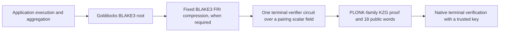

# BLAKE3 terminal statement

Status: proposed design. Baseline: `ap/init-recursive-kzg-minimal` at
`6d9d5ddad4fb9bfbabf8238ef87af6e9d7b3cab6`. Upstream references are pinned to
the revisions reviewed on 2026-10-08. Backend selection and recorded GPU
results were reviewed on 2026-10-09; see the
[conventional PLONK backend comparison](plonk-terminal-backend-review.md).

## Architecture decision

Prove the existing Goldilocks/BLAKE3 recursive verifier once with a
PLONK-family KZG backend. Preserve the root's 18-word public claim and select
the inner verification key, proof shape, application policy, and terminal
verification key from trusted configuration. The terminal circuit contains
BLAKE3 and Goldilocks verification arithmetic; its verifier performs the
terminal backend's ordinary KZG pairing check.

Poseidon and Poseidon2 are excluded from every proof layer, transcript,
commitment tree, and statement digest. An intermediate Poseidon wrapper is
not an option. BLAKE3 is required wherever the existing proof protocol uses
it. A backend with a standard Merlin, BLAKE2b, SHA-256, or Keccak transcript
can be considered under its own explicitly identified protocol; it must
preserve the inner BLAKE3 transcript exactly.

BLS12-381 is the initial comparison target, matching the current KZG baseline
and `GoldilocksCircuit`. Jellyfish UltraPlonk is the first existing-library
candidate on that curve. Axiom Halo2 with BN254 KZG is a separate candidate
profile, conditional on the consumer accepting its security margin and the
compiled layout fitting its domain limits. Prefer conventional PLONK
libraries; Proofman/PIL/PILFFLONK supplies upstream research context rather
than an implementation dependency. An in-house backend is a fallback after
library feasibility is established, not an assumed requirement.



The saved Init experiment enters at the compressed FRI proof. A future
profile may consume the root directly if that is cheaper. Neither profile
contains a circuit that verifies a KZG proof, exposes deferred pairing
accumulators, or proves nonnative elliptic-curve operations.

KZG is a polynomial commitment scheme; PLONK is a proof protocol that can use
KZG. Universal setup is available to both the current AIR/KZG construction
and a PLONK/KZG construction. The architectural question is which layout and
protocol produce the best complete terminal proof, and whether a second
recursive proof buys enough size reduction to justify its cost.

## Root statement and application meaning

The application claim is an array `C` of 18 canonical Goldilocks elements.
Let `pack32(d)` split a 32-byte digest into eight little-endian `u32` words,
embedded without reduction into Goldilocks and then into the terminal scalar
field. The root contract is:

```text
allowed = BLAKE3(ixvm_vk_bytes) || u64le(verify_claim_entrypoint)
       || BLAKE3(aggr_vk_bytes) || u64le(aggr_entrypoint)

C = [0, aggr_entrypoint]
 || pack32(BLAKE3(allowed))
 || pack32(BLAKE3(canonical_output_claim_bytes))
```

`allowed` is exactly 80 bytes. Its order and key serialization are part of
the application contract. The last digest commits to the complete serialized
output claim, including its kind, subject, and assumptions. It is not merely
a program-output hash.

| Public indices | Meaning | Required binding |
| --- | --- | --- |
| `0` | Function channel | Constrained to `0` |
| `1` | Aggregator entrypoint | Constrained to the trusted profile's index |
| `2..9` | Allowed-program digest, eight words | Each word is a `u32` and equals the trusted profile's digest |
| `10..17` | Output-claim digest, eight words | Each word is a `u32` and equals the caller's expected digest |

Expose all 18 words as terminal public inputs, including the values that are
also circuit constants. This preserves the baseline interface and makes
cross-backend comparison straightforward. Each public scalar has the exact
integer value of its word; neither encoding nor verification reduces an
out-of-range integer modulo a field.

For the archived Init profile the entrypoint is `293`, as recorded in
[the independently expected claim](../examples/support/init_claim.rs).
An entrypoint is a compiled-program index, not a permanent application ID.
The synthetic fixture in `examples/support/root_profile.rs` uses different
keys and an index of `17`; it is not the Init application contract.

The application verifier constructs the expected output claim independently
of the packet. For `CheckEnv`, that includes the expected subject root and
assumption root. A caller requiring an unconditional result must require
absent assumptions. A subtree proof, range-sum statement, or valid claim with
remaining assumptions does not become a closed root result by compression.
The terminal circuit need not reparse the output claim: it proves its digest,
and the application verifier hashes the exact canonical bytes it expects.

This contract follows ix's `aggregate_outer_claim` and `allowed_blob` in
`crates/ffi/src/aiur/aggregate/protocol.rs`, and
`aggregateOuterClaim` in `Ix/Aggr/Protocol.lean`, at ix revision
`91348190f091d53ab0838440eaeaf0cb36f2737f`. A production profile must pin the
actual compiled ix keys and claim serializer used by its root; current ix
source is not evidence that an archived key implements a newer contract.

## Circuit relation

For a fixed trusted descriptor `D`, public input `C`, and private proof `P`,
the terminal relation is:

```text
R_D(C, P) =
    RootWordConstraints_D(C)
    AND VerifyGoldilocksBlake3_D(inner_vk_D, ExpandStatement_D(C), P)
```

`RootWordConstraints` enforces the constants and ranges above.
`ExpandStatement` is a fixed wiring map, including every constant claim,
activation anchor, and batch message. `VerifyGoldilocksBlake3` checks the
complete supported proof protocol: statement absorption, Fiat-Shamir
challenges, AIR and lookup equations, Merkle authentication, FRI folding and
terminal evaluation, and grinding. Auxiliary inverses, hash outputs, and
rejection-sampling hints are constrained advice.

The private witness contains proof data and derived arithmetic values. It
does not choose a verification key, activation bitmap, FRI parameter set,
claim schema, or output interpretation. There is no host-only check whose
result substitutes for a circuit constraint on the proof.

### Init compatibility profile

Use the existing 1,530,149-byte FRI artifact and trusted `outer-vk.bin` for
the first experiment. Their identities are recorded in
[the artifact manifest](../experiments/init-fri-artifacts/files.json).
The exact claim expansion from [the fixture adapter](../examples/support/init_fri.rs)
is:

```text
claims[0]     = [107, 1, 0, 0]
claims[i + 1] = [107, 1, i + 1, C[i]]       for i = 0..17
claims[19+j]  = [107, 3, j]                for j = 0..9
claims[29+k]  = [107, 4, 3, k]             for k = 0..5
messages     = []
```

This is 35 claims, with 18 variable slots. The inner profile is ordinary,
with all 22 circuits active, heights fixed from the trusted key, and
`max_field_retries = 2`. Every namespace, anchor, length, ordering choice,
and constant belongs to the descriptor. The input proof cannot supply an
alternative map. The compatibility profile establishes equivalence with the
saved experiment; application deployment additionally requires authenticated
provenance for the compressed verifier key and the root verifier it embeds.

The archived artifact is one profile, not the only one. A root regenerated
from a newer ix build and exported with
[`ExportInitRoot.lean`](../experiments/ExportInitRoot.lean) certifies the
same 18 words but compresses to 19 circuits with seven arithmetic
partitions, so its `[107, 3, j]` claims run over `j = 0..6` and the fixture
adapter derives that count from the trusted key. The two profiles are
distinct `relation_id`s for one application statement; a descriptor pins
exactly one. [`ix_root.rs`](../examples/ix_root.rs) consumes the exported
`root-vk.bin`, `root-proof.bin` and `root-claims.bin` and accepts only a
one-shard batch carrying one 18-word claim whose first word is zero, which
is the supported root envelope assumed below. The independently expected
claim arrives through `MULTI_STARK_INIT_EXPECTED_CLAIMS` as a verifier
input; nothing reads it from the packet.

Keep the existing verifier's separation of assignments: assign the expected
statement through `assign_statement`, and assign only proof values through
`assign_proof`. When composing through `StatementBinding::Wire`, expose or
constrain every statement wire. An unconstrained private statement wire
changes the relation to an existential claim. See
[the verifier contract](plonkish-verifier.md).

### Supported proof profiles

The initial profile retains the current verifier's restrictions: Goldilocks
with quadratic extension challenges, BLAKE3, root-only Merkle caps, binary
FRI, a constant final polynomial, and ordinary or single-shard batch
envelopes. Preprocessing must be present and its circuits active. Retry
exhaustion rejects; retries cannot silently fall back to modular reduction.
These restrictions are enforced by
[`VerifierPlan::validate`](../src/plonkish/verifier/plan.rs).

ix's production root may use a vector of trace shards with a shared
transcript and lookup balance across shards. The present plan does not
verify that general contract. For the initial integration, use an explicitly
supported root envelope, including a supported single-shard batch root after
BLAKE3 wrapping if available, or retain the archived compression input.
Reject every unsupported batch shape. Supporting general batches requires
a separately reviewed circuit for their common challenges, ordering,
messages, and global residual balance; independently verifying shards with
zero residual is not equivalent. Measure any root normalization or extra
BLAKE3 wrapping in end-to-end results.

## Trusted descriptors and public verification

Keep three identities distinct. They are content identifiers, not sources
of trust.

| Identity | Contents |
| --- | --- |
| `relation_id` | Inner key bytes; Goldilocks and extension definitions; full inner transcript/hash/encoding specification; FRI and grinding parameters; `ProofProfile`; claim expansion and constants; application key digests, entrypoint and output-claim encoding version |
| `circuit_id` | `relation_id`; backend protocol and curve; lowering and custom-gate versions; layout, copy and lookup constraints; fixed coefficient digest; public-input order; blinding mode |
| `verifier_id` | `circuit_id`; SRS artifact identity and degree policy; canonical terminal verification-key bytes |

The fixed coefficient digest is computed before commitments, so `circuit_id`
does not depend on itself or on a verification-key digest. The verifier ID
includes the resulting key and SRS. Build provenance also records source
revisions and dependency locks; compiler-version labels alone do not identify
the compiled relation. The current `plan.identity` and `build_identity` are
useful inputs, not substitutes for the backend and application descriptor.

Use BLAKE3 with separate domain labels
`multi-stark/terminal/relation/v1`, `multi-stark/terminal/circuit/v1`,
and `multi-stark/terminal/verifier/v1`. For each identifier:

```text
ID(label, body) = BLAKE3(u32le(len(label)) || ASCII(label)
                    || u64le(len(body)) || body)
```

Descriptor bodies use a versioned, fixed-order binary schema. Integers have
declared widths and little-endian encoding; booleans are `0` or `1`; vectors
have `u32` element counts and byte strings have `u64` lengths. No `usize`,
unordered maps, JSON serialization, or implicit defaults participate in an
identity. Publish schema fixtures with the implementation before generating
interoperable keys.

The verifier receives a trusted key bundle from its caller or a local
allowlist. The bundle fixes all three identities, expected application
policy, exact public-input count, and decoding limits. Packet-provided IDs
must match that bundle; they cannot fetch or authorize new keys. Matching
an ID supplied next to a malicious key does not authenticate the key.

The terminal protocol binds the public inputs and trusted key context into
its transcript according to its versioned backend specification. Any change
to domain separation, challenge sampling, opening aggregation, or blinding
creates a new protocol identity. Reusing a library's standard transcript is
preferable to inventing a modified protocol merely for uniform hash naming.

### Verification API

The intended API has no proof-derived default for an expected statement:

```rust
fn verify_terminal(
    trusted: &TrustedTerminalVerifier,
    expected: &ExpectedRootStatement,
    packet: &[u8],
) -> Result<VerifiedRootStatement, VerificationError>;
```

`ExpectedRootStatement` comes from the application's canonical expected
claim and trusted program policy. Verification proceeds as follows:

1. Parse the fixed packet header and enforce the trusted byte limit before
   allocating proof objects. Require the exact version and verifier ID.
2. Derive the 18 expected words. Decode packet words canonically and compare
   all of them with the expected words, including the allowed-program digest.
3. Decode the terminal proof under the fixed backend codec. Reject trailing
   bytes, wrong dimensions, noncanonical scalars or points, and invalid
   subgroup encodings according to that protocol.
4. Verify against the trusted terminal key and the independently derived
   public scalars. Return the expected typed statement only after acceptance.

No packet flag may change leaf/root interpretation, application policy, or
the proof envelope. Such a change requires a separately trusted descriptor.

The lower-level verifier may accept the 18 expected words directly for
protocol testing. It must require all of them explicitly. Application code
uses the typed interface so a range statement or conditional claim cannot
be mistaken for the intended `CheckEnv` result.

### Packet encoding

Propose a small fixed envelope; the descriptor selects the proof codec.
All integer fields below are little-endian, and the parser requires exactly
the declared number of proof bytes followed by end-of-input.

| Field | Bytes | Rule |
| --- | ---: | --- |
| Magic | 4 | ASCII `B3TP` |
| Envelope version | 2 | `1` |
| Reserved | 2 | Must be zero |
| Verifier ID | 32 | Matches independently trusted bundle |
| Root claim | 144 | 18 canonical `u64` words in public-input order |
| Proof byte length | 8 | Checked against trusted codec limit before allocation |
| Proof | Variable | One terminal proof under the selected codec |

Envelope overhead is 192 bytes. The public digest words must be below
`2^32`; all words must be below `p = 2^64 - 2^32 + 1`. The full 256 bits of
each digest are retained. A digest must not be reduced into one pairing
scalar, and a profile must not silently replace 18 public words with an
unconstrained digest of those words. A future packed-public-input variant
requires explicit circuit equality constraints and a new descriptor.

The packet's root-claim field is a redundant statement copy for transport
and inspection. Verification compares it with independently expected words
and passes those expected words to the backend. Consumers must not treat
packet words as the source of the statement they intend to verify.

## Circuit construction and backend boundary

Reuse the trusted-key validation, fixed verifier plan, canonical BLAKE3
semantics, and bounded Goldilocks translation. The new work is a terminal
layout/backend adapter, not a second implementation of the inner verifier.

```text
trusted inner key + profile + statement map
                |
          VerifierPlan
                |
      Goldilocks verifier circuit
                |
  canonical translation into BLS12-381 Fr
                |
  terminal layout: arithmetic, copy, lookup, BLAKE3, publics
                |
       PLONK-family indexing/proving
```

Build the 18 public wires in an enclosing statement circuit, constrain their
ranges and profile constants there, and pass their fixed claim expansion to
`plan.constrain` through `StatementBinding::Wire`. Expose each public word
once, in the declared order. All other claim slots and messages use the
descriptor's constants. This adds the root policy without making the proof
normalizer responsible for assigning or authenticating it.

`GoldilocksCircuit` currently targets BLS12-381 Fr. It enforces canonical
Goldilocks values and bounded modular quotients; bounded integer relations
can lift directly. Preserve those bounds when changing layouts. Field
equality alone is insufficient for Goldilocks reductions, limb carries,
byte extraction, and challenge sampling. Extension coordinates and their
ordering remain exactly those of the input proof. See
[`foreign.rs`](../src/plonkish/foreign.rs).

The adapter consumes the circuit before
`lower_to_multi_stark[_sharded]`. Translating the existing multi-AIR output
through the same PCS merely reproduces the current first KZG stage. A
PLONK adapter must implement equivalent arithmetic, copy, lookup, public
input, and hash constraints in its own backend's supported layout.

Define a small compile/index/prove/verify boundary:

- Compilation takes only the trusted descriptor and circuit, emits a layout
  report and deterministic constraint artifact, and fixes every gate and
  opening set before seeing a witness.
- Indexing takes the artifact and validated universal SRS, produces the
  proving and verification keys, and records their identities.
- Proving takes independently supplied public words and the normalized inner
  proof, generates a witness, and returns the fixed packet format.
- Verification takes the trusted bundle and expected words, and performs
  ordinary backend verification. It has no recursive-accumulator API.

The size every backend must absorb is fixed by the archived input. The
stats lines printed by `init_fri_kzg_prove stage` for the stage-one source
circuit are:

| Quantity | Measured |
| --- | ---: |
| BLAKE3 compressions | 60,297 |
| Goldilocks gates / lookups | 39,256,939 / 7,503,584 |
| Translated BLS12-381 gates / lookups | 126,776,495 / 35,688,166 |
| Compact hash rows at about 240 per compression | about 14.5 million |

About 600 compressions per FRI query at 100 queries, blowup 2, root-only
Merkle trees and binary folding; the hash work dominates. A layout that
keeps one translated gate per row is near `2^27` rows before lookups and
padding, which is also the largest domain the documented Filecoin sequence
supports under Jellyfish's degree rule. Any mapping that multiplies the
compact row count by more than about two therefore needs either the inner
profile change of step 2a or a different setup.

Prefer an existing PLONK implementation with a non-Poseidon transcript,
canonical key/proof codecs, and the required curve and gate support.
Jellyfish exercises BLS12-381 UltraPlonk with Merlin, lookups, and canonical
serialization, but its gate trait selects coefficients from a fixed
polynomial family. Efficient BLAKE3 mapping remains unproven. Axiom Halo2
provides flexible polynomial gates, rotations, and lookups with a BN254 KZG
and BLAKE2b path. gnark can remain a reference implementation. See the
[backend comparison](plonk-terminal-backend-review.md) for sources and
integration limits.

Backend feasibility precedes full-circuit implementation: demonstrate a
complete BLAKE3 compression, representative Goldilocks reductions, range and
copy constraints, and 18 public inputs. For Jellyfish, start with a byte XOR
table and 16-bit range chunks, then report logical and padded rows, column
counts, lookup arguments, quotient degree, required SRS powers, proof size,
and memory. Compare total committed field elements as well as rows. A small
gadget fitting the setup is necessary but does not establish that the whole
verifier fits. Choose an in-house backend only if the library candidates
fail explicit layout, resource, or protocol requirements.

## Layout for BLAKE3 and KZG

The existing compact BLAKE3 implementation in
[`hash.rs`](../src/plonkish/hash.rs) is the semantic reference. Native BLAKE3
supplies witness advice only. All message bytes, padding, block lengths,
counters, flags, chunk chaining, parent nodes, root output, and word
rotations must remain constrained. Implement only the modes needed by the
fixed verifier, but do not replace its hash or XOF semantics with a raw
compression-function approximation.

Optimize total committed field elements and openings as well as row count.
The current layout has multiple arithmetic and hash traces, with commitments
per column and evaluations at required rotations. A very wide trace or a
single padded trace can be worse than several narrower ones. Report the
actual padded dimensions, quotient degree, and memory requirement for each
candidate before choosing a layout.

The conventional-library candidates share the same statement and witness
semantics:

| Candidate | Purpose | Main tradeoff |
| --- | --- | --- |
| Jellyfish UltraPlonk on BLS12-381 | Retain the existing curve and arkworks field translation | Fixed gate family may expand BLAKE3; GPU integration requires additional work |
| Axiom Halo2 with BN254 KZG | Express compact BLAKE3 using flexible gates, rotations, and lookups | Curve/security choice, extended-domain limits, and full layout cost need validation |
| Existing multi-AIR/KZG at a `2^28` height cap | Prove stage one as one tall trace instead of 21 traces at `2^24`, so the packet carries about 30 commitments instead of about 600 | No new backend or library; stage-one host RAM rises toward the recursive stage's ~460 GiB; the recursive wrap shrinks to an estimated `2^25` domain or becomes unnecessary |

The third row is the cheapest reference terminal. It changes only the
height cap passed to `lower_to_multi_stark_sharded` in
`examples/init_fri_kzg_prove.rs` and reuses the verified adapter and GPU
backend. Its commitment count and packet size are estimates from finding 4
of [the pipeline review](../experiments/kzg-pipeline-review.md); record the
staged stats line before any proving. If that packet meets the consumer's
budget, the library candidates compete against it rather than against the
recursive wrapper.

Proofman's draft BLAKE3 terminal AIR gives a concrete layout reference:
64 rows per compression, 16 state columns opened at current and next rows,
other columns opened only at the current row, and arithmetic/range checks
placed in otherwise available cells. Its shared message bus connects
repeated message use. These are layout ideas to evaluate within the chosen
conventional backend; its performance is not a proven speedup for ix. See the pinned
[BLAKE3 BN254 AIR](https://github.com/0xPolygonHermez/pil2-proofman/blob/d65236a3e720fdbe11ddfdcae07bc030628b0eef/setup/stark-recurser/plonk2pil/pil/blake3_bn128/wrap.pil).

Copy and lookup arguments must close within the terminal proof. Every active
hash invocation must be tied to its verifier wires, and every table read to
the correct fixed table and multiplicity. Padding rows, unused cells, and
disabled gates must have the backend's prescribed constraints. A single-AIR
backend cannot accept the existing multi-AIR result by dropping its global
links; those links must be represented by a sound internal permutation or
lookup argument.

FFLONK-style polynomial packing, `f(X) = sum_j p_j(X^k) X^j`, can reduce the
number of commitments. Grouping must respect commitment stages and opening
sets. It changes degrees, root/evaluation work, blinding bounds, and SRS
capacity; it is not a free serialization optimization. SHPLONK-style
opening aggregation changes opening proofs, but does not by itself eliminate
column commitments and evaluations. See Proofman's
[packing and degree specification](https://github.com/0xPolygonHermez/pil2-proofman/blob/d65236a3e720fdbe11ddfdcae07bc030628b0eef/pilfflonk/docs/protocol.md).

Study inner FRI tuning alongside backend sizing while retaining the unchanged
input as a comparison baseline. Larger blowup or folds, a nonconstant final
polynomial, more explicitly supplied Merkle levels, or a different grinding
budget can trade expensive BLAKE3 work for arithmetic. Each changes the
trusted inner profile and may require extending `VerifierPlan`. The required
reduction in compression count depends on the full compiled terminal; an
order-of-magnitude reduction is not an established prerequisite. Recompute
the soundness bound and measure root production as well as terminal
verification for each candidate profile.

## Curve, setup, security, and privacy

BLS12-381 is the initial target to reuse the existing scalar translation,
SRS handling, and GPU MSM/NTT work. A BN254 implementation needs its own
foreign-arithmetic bound checks, FFT-domain limits, codecs, transcript,
pairing verification, and SRS. A terminal curve change can remain isolated
from the existing BLS12-381 baseline. Proofman's PILFFLONK code targets BN254;
its implementation is an architectural reference, not the selected backend.

A BN254 profile trades security margin for ecosystem. Its scalar field's
two-adicity of 28 is a hard domain ceiling independent of any setup. Its
pairing security is about 100 bits after the tower number-field-sieve
attacks, against roughly 120 for BLS12-381, and the composed-security
statement must carry that figure. In exchange it has the largest public
universal setups: the Perpetual Powers of Tau sequence distributed as
Hermez `.ptau` files reaches `2^28` with G2 powers, and Aztec Ignition
supplies 100,800,000 G1 points, which SP1 imports and verifies from
contribution 174 onward. Every candidate's GPU path is BN254 today:
Jellyfish's ICICLE integration, gnark's Groth16 ICICLE build, and sppark's
kernels. Switching the terminal costs a port of `src/ark_adapter`, whose
field, commitment, SRS and domain modules are typed on `ark_bls12_381`
with a two-adicity constant of 32; a `.ptau` or Ignition importer with
full validation, which the development SRS cache is explicitly not; a
recheck of the `foreign.rs` bound that every product stays below `2^209`,
which fits a 254-bit field but is asserted for BLS12-381; and a BN254
instantiation of `cuda/kzg*.cu`, which is BLS12-381 only. Make the curve
a step 2 decision from the consumer's required security level, whether
on-chain verification matters, and the measured layouts on each curve.

A universal, updatable powers-of-tau SRS can serve multiple circuits within
its degree capacity. Circuit indexing still generates circuit-specific keys,
and a circuit update changes the trusted terminal key. Avoid requiring a new
circuit-specific ceremony, but record the actual setup provenance and every
required power. Universal setup alone does not distinguish PLONK/KZG from
the current KZG architecture. See the
[PLONK construction](https://eprint.iacr.org/2019/953) and
[current PCS contract](pcs-abstraction.md).

Use actual power counts rather than ceremony labels when checking capacity.
Filecoin's documented power-27 BLS12-381 ceremony contains `2^28 - 1` G1 tau
powers. Jellyfish requires maximum degree `n + 2`, so the documented sequence
can support a `2^27` evaluation domain. This is a capacity calculation;
production use still requires an authenticated full artifact and validated
conversion. For Halo2 on BN254, the extended quotient domain must fit within
the field's two-adicity of 28: `k + ceil(log2(d - 1)) <= 28`, where `d` is the
configured constraint-system degree. Degree 5 therefore allows at most a
`2^26` base domain in that implementation. See the
[setup and domain analysis](plonk-terminal-backend-review.md#setup-capacity).

The existing artifacts use a known-trapdoor development SRS. They are
correctness and cost fixtures, not deployable proof systems. A production
bundle must use authenticated ceremony parameters, validate their encoding
and consistency according to the backend, and establish that their capacity
covers witness, quotient, packed, and blinded polynomials. The current
adapter's shifted degree checks require specific G2 powers and a complete
degree policy; truncating a larger SRS does not establish the required
smaller degree bound. A different PLONK backend follows its own analyzed
degree-enforcement rules instead of copying these checks piecemeal.

The composed security target is bounded by the inner STARK, BLAKE3 uses,
terminal argument, pairing curve, and setup assumptions. Compression does
not raise the inner proof's soundness. Production profiles must state the
target and analysis, including query count, blowup, extension field,
grinding, transcript sampling, and the total composed error. The experimental
profile is not assigned a production security level by this design.

The current multi-stark construction does not establish zero knowledge.
The first backend comparison may retain that scope, explicitly identified
in the descriptor. If hiding the inner proof is required, use the selected
backend's complete zero-knowledge construction, secure randomness, and
blinding bounds, and include that cost in comparisons. Calling proof data
private witness does not itself establish zero knowledge. The public root
statement remains public in either mode.

## GPU integration and cost comparison

The current GPU baseline remains independently useful. Reuse its field
arithmetic, MSM, NTT, polynomial buffers, transfers, and profiling interfaces
where the selected backend permits. Different polynomial schedules and
commitment layouts still need integration; reuse is not automatic merely
because two backends use KZG. Keep protocol constraints independent of the
CPU/GPU execution choice.

Retain a comparison of three complete packets for the same application claim
and the same input FRI proof. Measure additional inner profiles separately:

| Path | Terminal stages after the shared FRI input | Archived size or target |
| --- | --- | --- |
| Existing first KZG stage | Goldilocks verifier to multi-AIR/KZG | 53,157-byte proof; 53,333-byte packet |
| Current recursive KZG baseline | First KZG stage, then recursive KZG verifier and external pairing checks | 2,053-byte outer proof; 2,757-byte packet |
| Proposed terminal | One BLAKE3 verifier under the selected PLONK-family backend | Measure proof bytes plus 192-byte envelope |

The archived recursive KZG circuit has 237,408,925 rows and a padded `2^28`
computation trace. Removing it eliminates that particular circuit, including
its nonnative curve/MSM work; it does not predict the new terminal's proving
time. The archived CPU wrapper run includes setup and reports 10,011 seconds
and 485.5 GiB peak RSS. Those are historical harness results, not a floor on
GPU performance. See [the baseline experiment](../experiments/kzg-wrap/README.md).

The first KZG stage already proves the terminal's inner-verification relation.
Its [archived CPU record](../experiments/init-fri-kzg-proof.json) reports
7,204.49 seconds total wall time, including staging, proving, and a separate
verification process, with 219,099,598,848 bytes peak RSS (204.1 GiB).
Its [parameters](../experiments/init-fri-kzg-artifacts/parameters.json) use
21 traces, a `2^24` SRS length, and quotient degree budget 2. These provide a
measured implementation baseline, not a lower bound on another layout.

The GPU checkout records the following distinct workloads as of 2026-10-09:

| Input and cache state | Timing boundary | Wall time |
| --- | --- | ---: |
| Historical 1,530,149-byte compressed FRI proof; fresh development SRS and fixed preprocessing | Both KZG staging/proving phases; preceding FRI compression excluded | 1,740.20 s (29m00s) |
| Regenerated 19-circuit root profile; populated development SRS cache, fresh fixed preprocessing | FRI compression plus both KZG stages | 1,200.96 s (20m01s) |
| Same regenerated profile; populated development SRS and fixed preprocessing caches, fresh witnesses/proofs | FRI compression plus both KZG stages | 869.47 s (14m29s) |

Sources: [historical GPU report](../experiments/kzg-cuda-validation/sub30-v1-pipeline-report.json)
and [GPU data-movement results](../experiments/kzg-cuda-gpu-feeding-results.json).
All rows exclude root generation and the additional independent CPU checks.
The regenerated compressed proof is 1,418,855 bytes with a smaller profile;
its timings cannot establish a speedup over the historical input. Cache
population costs are excluded from the cached rows. The terminal comparison
must match the selected input and cache boundary, rather than assume that
the earlier 15m33s recursive-stage cost remains current.

The existing [pipeline review](../experiments/kzg-pipeline-review.md) contains
historical findings and prospective optimization estimates. Use the measured
JSON records for observed performance and their stated remaining limitations.
The architectural case rests on measured cost and packet requirements.
Two of the review's estimates bear directly on this design and are
recorded by steps 2a and 2b below: stage one as a single `2^28` trace, and
the compression step at blowup 8 with about 34 queries, which it projects
at roughly one third of today's compressions at the same conjectured
security level the repository's `FriParameters` discussion uses. Proofman's
provable-soundness formula gives 73 queries at blowup 8 with 20 grinding
bits, as recorded in [upstream GPU orchestration](upstream-gpu-orchestration.md);
the two regimes must not be mixed in one comparison. Neither candidate has
been staged or proved.

The GPU backend already covers the domain a single terminal needs. FFTs
run whole on one device, with a `2^29` scalar vector occupying 16 GiB and
an explicit `2^29` coset FFT check passing in 3.58 s; `2^29` MSMs are split
across devices; transforms are capped at log size 31. Lookup and
constraint sweeps remain on the CPU, which is where the measured idle time
comes from.

The recursive stage's fixed-preprocessing cache binds the expected Init
statement because the wrap builder allocates claim values as constants in
`experiments/kzg-wrap/src/native_verifier.rs` and rebinds them to public
wires afterwards. That is the exact defect the acceptance criteria below
forbid for the terminal: allocate the 18 public slots first, then version
the circuit and keys.

Record these quantities per profile and backend:

- Setup/indexing and key/SRS loading, separated from steady-state proving.
- Input normalization, witness generation, layout materialization, transfers,
  FFTs, MSMs, quotient/lookup work, opening generation, serialization, and
  final verification. Distinguish elapsed time from overlapping GPU timings.
- Logical and padded rows per region; advice, fixed and auxiliary columns;
  total field elements; lookup sizes; quotient degree; rotations; commitment,
  evaluation and opening counts; actual SRS capacity.
- End-to-end application-to-accepted-packet time, plus the isolated terminal
  segment using an identical saved input. Include every required wrapper.
- Peak host RAM, device VRAM, disk/checkpoint traffic, complete packet bytes,
  and warm and cold verifier latency; record hardware and concurrency.

Use matching security and privacy settings, and disclose any curve change.
The complete packet includes externally checked accumulators when a backend
requires them. Setup amortization must be explicit. Repeated proofs must use
fresh randomness when required; replaying a committed witness checkpoint
measures only the remaining stage.

A single terminal becomes the preferred architecture when it meets the
consumer's packet/verification requirements and improves the relevant
proving or resource budget on that comparison. If roughly 53 kB is already
acceptable, stopping at the first existing KZG stage is also a valid outcome.
The archived 2,757-byte packet is a useful comparison target, not an assumed
size bound for an unimplemented backend.

## Implementation sequence and acceptance criteria

| Step | Concrete output | Acceptance condition |
| --- | --- | --- |
| 1. Statement contract | Typed expected statement, canonical encoding, descriptor and packet fixtures | Exact reproduction of the archived 18 words and 35 expanded claims; no packet-derived expected values |
| 2. Backend feasibility | Complete BLAKE3 compression and representative arithmetic/range/copy/public-input circuits in Jellyfish and, if eligible, Axiom Halo2 | Correct constraints and verification; non-Poseidon transcript; numeric rows/columns/lookup/degree/memory report; SRS and extended-domain capacity checks |
| 2a. Inner profile sizing | Unchanged baseline plus separately specified FRI candidates, including blowup 8 at about 34 queries | Hash-call and full-layout estimates under an explicit soundness target; stage-one stats line for each candidate; no unsupported profile accepted |
| 2b. Tall-trace reference | Stage one staged at a `2^28` height cap on the existing backend | Stats line, commitment count, padded dimensions and host RAM recorded before proving; packet size estimated from the commitment count |
| 3. Reference terminal | Existing verifier and canonical field translation under the chosen backend | Same saved FRI proof accepted with the exact expected claim; all statement mutations rejected; layout report precedes full proving |
| 4. Compact layout | Custom BLAKE3, range and copy/lookup layout with equivalent semantics | Differential agreement with reference circuits; lower measured cost under a stated resource objective |
| 5. Complete comparison | GPU terminal and recursive-baseline records with identical inputs | Complete packets verified, phase boundaries documented, setup/cache/security differences visible |
| 6. Application integration | Authenticated root and terminal profiles, typed ix verification path | Supported root envelope, expected `CheckEnv` semantics, production setup provenance and security review |

Do not make the terminal backend depend on changes to the in-progress GPU
baseline. Add it behind its own experimental boundary, and integrate shared
GPU primitives after their interfaces settle. No production acceptance path
should automatically fall back to another key, hash family, envelope, or
development SRS when a profile fails validation.

Tests should exercise the relation and trust boundary, not just host witness
generation. Mutate witnesses directly where necessary so host-side advice
checks cannot conceal missing constraints.

| Area | Required negative and differential cases |
| --- | --- |
| Statement binding | Change each of the 18 words independently; wrong allowed digest or entrypoint; a valid proof for another output claim; changed public-input order |
| Application meaning | Wrong subject; assumptions present where a closed result is required; range/subtree statement substituted for the expected root; noncanonical claim serialization |
| Key and profile binding | Proof-supplied key/ID; different activation or height; altered preprocessing; unsupported envelope, cap, fold or final polynomial; nonzero batch messages where none are allowed |
| Arithmetic | Goldilocks `p-1`, `p`, and `2^64-1`; digest words at `2^32`; bad quotient/carry; invalid extension-coordinate order; zero-denominator advice |
| BLAKE3 and transcript | Empty and partial blocks, exact block/chunk boundaries and parent nodes; counter/flag/padding changes; altered digest byte; wrong absorption order; retry exhaustion and grinding failure |
| Layout and backend | Broken copy edge or lookup multiplicity; detached hash input/output; malicious padding; missing opening or quotient contribution; invalid scalar/point/subgroup encoding |
| Packet and setup | Truncation, appended bytes, oversized length, reserved bits, wrong verifier ID; incompatible SRS and key; development parameters in a production bundle |

Keep one generated layout and trusted key reusable across more than one
valid proof witness. The archived Init claim remains a regression vector;
its output digest must not accidentally become a circuit constant. Use small
synthetic profiles to test multiple statements before any full-size run.

## Upstream evidence and remaining choices

SP1 v6.8.1 demonstrates the separation between a hash-based recursive proof
and a final conventional PLONK proof: its
[terminal builder](https://github.com/succinctlabs/sp1/blob/c84ada1ed5911f28c4d3c9d0ed2f9e6cd7edb824/crates/recursion/gnark-ffi/go/sp1/build.go)
compiles a gnark SCS over BN254 from a JSON instruction list emitted by the
Rust recursion compiler, downloads and verifies the Aztec Ignition
transcript from contribution 174, converts it to Lagrange form and calls
`plonk.Setup`. Rust reaches the Go prover through a cgo `c-archive`; the
Go module pins gnark v0.14.0 replaced by the `p4u/gnark` fork and a
gnark-crypto v0.19.3 prerelease, and only its Groth16 path has an ICICLE
build. Its public inputs are five BN254 scalars.
Its recursion hash configuration uses
[Poseidon2](https://github.com/succinctlabs/sp1/blob/c84ada1ed5911f28c4d3c9d0ed2f9e6cd7edb824/crates/primitives/src/lib.rs),
so SP1 supplies an architectural precedent, not an eligible proof pipeline
or a BLAKE3 performance estimate. Its GPU prover is open source in the same
repository (`sp1-gpu/` at `4ed918fe19c98db041066ea7a2c5f3201a4f03db`); the
Poseidon2 wrap STARK runs on the GPU and the final Groth16 or PLONK proof
runs in gnark on the CPU, optionally with ICICLE. Its device model is
summarized in [upstream GPU orchestration](upstream-gpu-orchestration.md).

Proofman's draft [PR #610](https://github.com/0xPolygonHermez/pil2-proofman/pull/610),
pinned at `d65236a3e720fdbe11ddfdcae07bc030628b0eef`, implements a BLAKE3
recursive proof verified by a BN254 circuit and compressed with PILFFLONK.
Its [setup path](https://github.com/0xPolygonHermez/pil2-proofman/blob/d65236a3e720fdbe11ddfdcae07bc030628b0eef/setup/pil2-stark/src/commands/setup_snark.rs)
requires PILFFLONK for that BLAKE3 terminal. It is an architectural precedent
for proving the BLAKE3 verifier once; conventional PLONK libraries remain
the implementation preference. The implementation's
[single-AIR scope](https://github.com/0xPolygonHermez/pil2-proofman/blob/d65236a3e720fdbe11ddfdcae07bc030628b0eef/pilfflonk/docs/README.md)
excludes the general multi-AIR/global-constraint contract. Adopting its
layout therefore needs an explicit lowering and copy/lookup design.

The setup commands in
[v1.3.1-alpha](https://github.com/0xPolygonHermez/pil2-proofman/blob/a4ca318540061194ecc2d3ae7483f47e95b4716e/setup/pil2-stark/src/commands/setup_snark.rs),
[pre-develop-1.3.2-alpha](https://github.com/0xPolygonHermez/pil2-proofman/blob/80914c90895cf601874580a5fd8f3d4c394b47af/setup/pil2-stark/src/commands/setup_snark.rs),
and [pre-develop-1.4.0-alpha](https://github.com/0xPolygonHermez/pil2-proofman/blob/23eaf736806875aec8ac2ff0f1a47659e458a481/setup/pil2-stark/src/commands/setup_snark.rs)
do not provide that draft BLAKE3 terminal path. The draft's headline wrapper
timings are labeled Poseidon2 in its
[performance document](https://github.com/0xPolygonHermez/pil2-proofman/blob/d65236a3e720fdbe11ddfdcae07bc030628b0eef/pilfflonk/docs/performance.md).
They are excluded from the BLAKE3 cost comparison. The same document's GPU
section does record key-level figures for a BLAKE3 wrap key (`2^20` rows,
65 fixed columns, a 30.4M-power SRS; 0.72 s key load, 9.04 s opening before
its interpolant fix); those are phase measurements on an RTX 5090, not an
end-to-end BLAKE3 wrap time, and its wrap AIR spends 64 rows per compression
(`setup/stark-recurser/plonk2pil/pil/blake3_bn128/wrap.pil`). The
BLAKE3-specific FRI tradeoffs in
[pre-develop-1.4.0-alpha](https://github.com/0xPolygonHermez/pil2-proofman/blob/23eaf736806875aec8ac2ff0f1a47659e458a481/common/src/hash_family.rs)
motivate separately specified profile candidates during backend sizing.

Open statement-binding work in
[Proofman #620](https://github.com/0xPolygonHermez/pil2-proofman/pull/620) and
[ZisK #1368](https://github.com/0xPolygonHermez/zisk/pull/1368) reinforces the
need for independently expected publics and authenticated verifier keys.
This design requires both at the API boundary regardless of upstream merge
status. It does not infer that a release is vulnerable merely because a
related PR remains open.

Five implementation choices remain to be resolved by the stated gates:
the PLONK library and its gate support; the winning compact layout, including
whether the existing backend at a `2^28` cap already meets the packet
budget; the terminal curve and its authenticated SRS with sufficient
capacity for the chosen production security profile; the inner FRI profile
once step 2a is measured; and the consumer's acceptable
packet/verification budget. These
choices do not change the 18-word root relation or permit Poseidon. They
determine which implementation of that relation should replace, complement,
or stop before the current recursive KZG wrapper.
